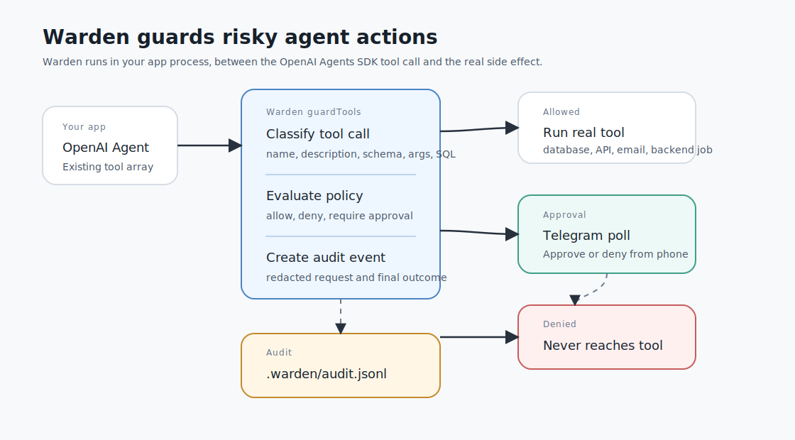

# How Warden Works

Warden is an action boundary for app-built agents. It does not replace the model or the OpenAI Agents SDK. It wraps the point where the model's requested tool call would become a real application side effect.



## The Problem

An app-built agent can choose tools that change real systems:

- update a database row
- send an email
- post to Slack
- call a third-party API
- trigger a backend workflow
- issue a refund

Without an action boundary, a risky tool can execute as soon as the model chooses it. The developer may see the result only after the side effect has already happened.

Warden fixes that by turning every tool call into a decision point.

## The Pipeline

Every guarded call follows the same pipeline.

### 1. Capture Tool Metadata

Warden receives:

- tool name
- description
- parameter schema
- arguments
- optional client, agent, user, run, and call ids

For the OpenAI Agents SDK, `guardTools()` reads the same metadata `tool(...)` uses. It accepts either the raw definition object (before `tool()`) or the `FunctionTool` value `tool(...)` returns, so it drops into new or existing agents unchanged. Entries with no local `execute()`/`invoke()` — hosted tools like web search, which run on OpenAI's servers — are passed through unguarded with a warning, since there is no local call for Warden to intercept.

### 2. Classify Risk

Warden assigns risk labels with deterministic heuristics. Examples:

| Signal | Risk labels |
| --- | --- |
| `search`, `get`, `list`, `readOnlyHint` | `read` |
| `create`, `update`, `write`, `patch` | `write` |
| `delete`, `drop`, `truncate`, `revoke` | `destructive` |
| `send`, `email`, `message`, `webhook` | `external_send` |
| URLs or HTTP-like parameters | `network_egress` |
| `token`, `password`, `secret`, `api_key` | `credential_access`, `sensitive_data` |
| `refund`, `payment`, `charge`, `invoice` | `financial`, `external_send` |
| SQL strings | read/write/destructive/sensitive/code/network labels from SQL content |

The classifier is intentionally conservative. Unknown or vague tools require approval by default.

### 3. Evaluate Policy

Policy maps risk labels, tool names, and argument conditions to decisions:

```yaml
defaults:
  read: allow
  write: require_approval
  external_send: require_approval
  credential_access: deny
  financial: deny

tools:
  openai.search_orders:
    decision: allow
  openai.issue_refund:
    acknowledge_risks: [financial]   # accept the default financial deny for this tool
    decision: require_approval
    rules:                           # argument conditions, first match wins
      - when:
          amount: { lte: 50 }
        decision: allow
      - when:
          amount: { gt: 500 }
        decision: deny
```

Decision types:

- `allow`: execute the tool immediately.
- `deny`: never call the underlying tool.
- `require_approval`: pause and wait for a reviewer.
- `redact_then_allow`: pass redacted arguments to the tool.

Precedence, highest first:

1. A default `deny` for a risk the tool has **not** acknowledged. This always wins — a tool override cannot make credential or financial risks safe by accident. Listing a label under `acknowledge_risks` is the explicit opt-out, and even then the label is floored at `require_approval` unless the tool sets its own decision or a rule matches.
2. The tool's `rules`, evaluated in order against the call's arguments — the first rule whose every condition holds applies. Conditions address arguments by dot path (`customer.email`) and support `eq` (a bare scalar is shorthand), `ne`, `gt`, `gte`, `lt`, `lte`, `in`, `contains`, `matches` (regex), and `exists`. Numeric comparators coerce numeric strings, so `"amount": "900"` still trips a `gt: 500` rule; everything else only matches when the argument is present with the expected type.
3. The tool's `decision`.
4. The strongest decision among the call's risk-label defaults.

Approver-edited arguments are re-classified and re-checked against the same policy (including rules) before they execute.

### 4. Request Approval

If policy returns `require_approval`, Warden creates an approval request with redacted display arguments.

The scaffold defaults to the terminal `prompt` method, which works with zero setup:

```yaml
approval:
  method: prompt   # prompt | telegram | callback | deny
  timeout: 5m
```

The reviewer sees the tool, risk labels, policy rule, and redacted arguments. With `prompt` that appears in the terminal; with `telegram` it is a phone poll; with `callback` it runs your own function. If the reviewer approves before timeout, Warden executes the original call. If they deny, do not respond, or there is no terminal to ask at, Warden fails closed.

### 5. Execute Or Block

Only the executor gate can call the underlying function. Denied, expired, or unsupported calls do not reach the real tool.

The flow for OpenAI function tools:

```text
Agent -> guardTools wrapper -> Warden decision -> original execute function
```

### 6. Audit

Every decision produces a JSONL audit event:

- timestamp
- client, agent, user if known
- tool name and upstream
- risk labels
- policy version
- decision and rule
- redacted request arguments
- executed arguments if any
- response status
- duration
- error if blocked or failed

Use:

```bash
warden audit tail --limit 20
```

## What Warden Is Not

Warden is not a prompt. It does not ask the model to behave. It controls whether the requested tool call reaches the real `execute` function.

Warden is not a general sandbox. If your app exposes a second unguarded path to the same API, Warden cannot control that path. The fix is to route side-effecting actions through the agent's guarded tools.

## What Makes Adoption Easy

The OpenAI path is designed to preserve your existing app. If you already build tools with `tool(...)`, wrapping the array you pass to the agent is the whole change:

```ts
const agent = new Agent({ name: "support", tools: guardTools(existingTools) });
```

Defining tools as raw objects instead? Wrap before `.map(tool)`:

```ts
const tools = guardTools(rawTools).map(tool);
```

Either way, your agent, prompts, `run(...)` call, schemas, and business functions stay the same. Warden adds the decision boundary at the last responsible point before side effects happen.
