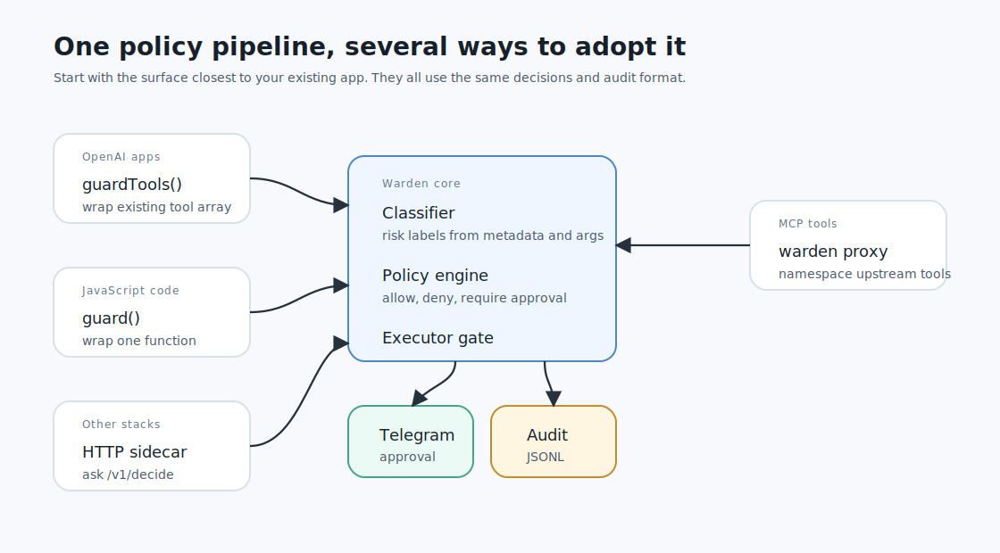

# Integration Surfaces

Warden has several adoption surfaces. Pick the one closest to your current app.



## Recommended Starting Point

If you use `@openai/agents` function tools, start with `guardTools()`.

```ts
const tools = guardTools(rawTools).map(tool);
```

This is the primary product path because it is the smallest change for teams that already have app-built agents.

## Surface 1: OpenAI Agents SDK Function Tools

Use this when:

- your app uses `@openai/agents`
- your tools are JavaScript or TypeScript functions
- the model currently calls `tool({ name, description, parameters, execute })`
- you want Telegram approval before risky `execute` functions run

Shape:

```ts
import { tool } from "@openai/agents";
import { configureWarden } from "@maokner/warden";
import { guardTools } from "@maokner/warden/openai";

configureWarden();

const rawTools = [
  {
    name: "update_subscription",
    description: "Update a customer's subscription plan",
    parameters: updateSubscriptionSchema,
    execute: updateSubscription,
  },
];

export const tools = guardTools(rawTools).map(tool);
```

Best for:

- existing OpenAI Agents SDK apps
- SaaS support agents
- CRM agents
- finance or operations assistants
- agents that send messages or update app data

## Surface 2: Generic Function Guard

Use this when:

- the side effect is not exposed as an OpenAI tool yet
- several code paths call the same risky function
- you want to guard a backend function directly

Shape:

```ts
import { configureWarden, guard } from "@maokner/warden";

configureWarden();

export const sendEmail = guard("app.send_email", rawSendEmail, {
  description: "Send an email to a customer",
});
```

Best for:

- backend jobs
- shared service functions
- direct API wrappers
- non-agent code that should follow the same policy

## Surface 3: MCP Gateway

Use this when:

- your agent gets tools from MCP servers
- you want Warden to own upstream MCP tool routing
- you want each upstream tool namespaced and policy-checked

Shape:

```yaml
upstreams:
  crm:
    transport: stdio
    command: node
    args:
      - ./crm-mcp-server.js
```

Run:

```bash
warden proxy --config warden.yaml
```

Best for:

- MCP-based tool ecosystems
- internal MCP servers
- apps that want one Warden MCP server in front of many upstream servers

Current MCP support is intentionally minimal: stdio, `initialize`, `ping`, `tools/list`, and `tools/call`. See [MCP gateway](mcp-gateway.md).

## Surface 4: HTTP Decision Sidecar

Use this when:

- your app is not TypeScript
- the action executor lives in another process
- you want Warden to decide but your app will perform the final action

Shape:

```bash
warden serve --config warden.yaml --port 8787
```

```bash
curl -s http://127.0.0.1:8787/v1/decide \
  -H 'Content-Type: application/json' \
  -d '{"tool":"crm.update_customer","arguments":{"customerId":"cus_123","plan":"pro"}}'
```

The sidecar returns `forwardArguments` only when the app may execute the action.

Best for:

- Python, Go, Ruby, or JVM apps
- existing internal APIs
- systems where the action executor cannot import the Warden TypeScript package

## Choosing A Surface

| Existing app shape | Use | Why |
| --- | --- | --- |
| `@openai/agents` function tools | `guardTools()` | Smallest migration |
| Shared JavaScript side-effect function | `guard()` | Guard every caller |
| MCP tool servers | `warden proxy` | Warden owns tool routing |
| Non-TypeScript executor | HTTP sidecar | App asks Warden before acting |

## One Policy Across Surfaces

All surfaces feed the same policy engine. That means a tool called `openai.send_email`, `app.send_email`, `crm.send_email`, or `mcp_crm__send_email` can be governed with the same risk defaults and with targeted tool-specific overrides.

Keep policy strict by default and loosen only after audit data shows which tools are safe.
