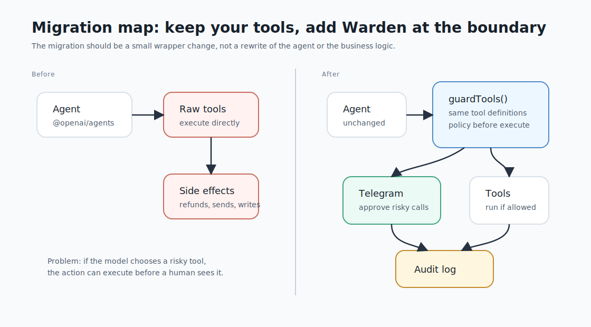

# Migrating Existing Agents

Use this guide when your OpenAI Agents SDK app already works and you want Warden to guard the actions without changing the agent's behavior.



## Migration Principle

Do not rewrite the agent first. Wrap the tools the agent already uses with Warden and keep your existing `execute` functions exactly as they are.

The smallest safe migration is one line — `guardTools()` accepts the `tool(...)` objects you already built:

```ts
configureWarden();
const agent = new Agent({ name: "support", tools: guardTools(existingTools) });
```

If you prefer to keep tools as raw definitions, wrap the array and `.map(tool)` instead:

```ts
configureWarden();
const tools = guardTools(rawTools).map(tool);
```

Full examples:

- [Before Warden](../examples/openai-existing-agent-before.ts)
- [With Warden](../examples/openai-existing-agent-with-warden.ts)

## Step 1. Inventory Existing Tools

List every tool the agent can call and put it in one of these buckets:

| Bucket | Examples | Default Warden behavior |
| --- | --- | --- |
| Read-only lookup | search orders, get customer, list docs | allow |
| App mutation | update ticket, create record, change plan | require approval |
| External send | email, Slack, webhook, publish comment | require approval |
| Code or network execution | shell, HTTP fetch, browser automation | require approval |
| Credentials or secrets | token lookup, OAuth export, env read | deny |
| Financial | charge, refund, payout, invoice payment | deny |

If a tool can both read and mutate, split it into two tools before migration. Warden is much easier to reason about when tools have one clear side effect.

## Step 2. Wrap The Agent's Tools

Many apps start like this:

```ts
const tools = [
  tool({
    name: "update_ticket",
    description: "Update a support ticket",
    parameters: updateTicketSchema,
    execute: updateTicket,
  }),
];

const agent = new Agent({ name: "support", tools });
```

The smallest change wraps that same `tools` array — no other edits:

```ts
const agent = new Agent({ name: "support", tools: guardTools(tools) });
```

`guardTools()` detects the already-constructed `FunctionTool` objects and wraps each tool's executor, so Warden classifies and enforces before your `execute` runs.

If you'd rather keep tools as raw definitions (often cleaner for new code), drop the `tool()` calls and wrap before `.map(tool)`:

```ts
const rawTools = [
  {
    name: "update_ticket",
    description: "Update a support ticket",
    parameters: updateTicketSchema,
    execute: updateTicket,
  },
];

const tools = guardTools(rawTools).map(tool);
```

Raw definitions, constructed tools, or a mix all work. Wrap the **whole array** either way so coverage stays automatic as you add tools.

## Step 3. Configure Warden Once

Call `configureWarden()` once at app startup, before constructing agents.

```ts
import { configureWarden } from "@maokner/warden";

configureWarden({
  configPath: "warden.yaml",
});
```

For most apps, do not pass policy inline. Keep it in `warden.yaml` so operators can inspect and review it separately from code changes.

## Step 4. Generate The Starter Policy

```bash
warden init --policy-only
```

The generated policy is intentionally conservative:

- `read: allow`
- `write`, `external_send`, `network_egress`, `code_execution`: `require_approval`
- `credential_access`, `financial`: `deny`
- `approval.method: prompt`

This is the right starting point for old codebases because it prevents silent side effects while you learn what the agent actually does. Approvals appear in the terminal by default. For a background or production agent, pair Telegram (`warden login --token <bot-token>`) and set `approval.method: telegram`, or use `approval.method: callback` to wire your own approval UI — the terminal `prompt` fails closed when no interactive terminal is attached.

## Step 5. Keep Tool Metadata Specific

Warden's classifier uses deterministic signals. Better metadata improves the decision before you write custom policy.

Use names like:

```text
search_customer_orders
send_refund_confirmation_email
update_subscription_plan
create_billing_note
```

Avoid names like:

```text
execute
run_action
tool
helper
```

Descriptions should say the side effect plainly:

```ts
description: "Send a refund confirmation email to a customer"
```

Schemas should use specific field names:

```ts
parameters: z.object({
  customerEmail: z.string(),
  refundAmountUsd: z.number(),
  internalNote: z.string(),
})
```

## Step 6. Decide How Blocks Surface To The Model

By default, a blocked OpenAI tool returns a short model-visible string:

```text
Warden blocked this action (require_approval). Approval expired.
```

If your agent needs a custom shape, pass `onBlocked`:

```ts
const tools = guardTools(rawTools, {
  onBlocked: (result) => ({
    status: "blocked_by_policy",
    reason: result.error ?? result.decision.reason,
    decision: result.decision.decision,
  }),
}).map(tool);
```

Do not hide policy failures from the model. The model needs to know the action did not run.

## Step 7. Add Narrow Policy Overrides

After you collect audit events, add targeted rules:

```yaml
tools:
  openai.search_customer_orders:
    decision: allow

  openai.update_subscription_plan:
    decision: require_approval
    approval:
      approvers:
        - support-lead

  openai.issue_refund:
    acknowledge_risks: [financial]   # this tool is supposed to move money
    decision: require_approval
    rules:                           # argument conditions, first match wins
      - when:
          amount: { lte: 50 }
        decision: allow
      - when:
          amount: { gt: 500 }
        decision: deny
```

A tool-specific `allow` cannot override a default `deny` for credential or financial risks. That is deliberate. The explicit opt-out is `acknowledge_risks`: a tool that is *supposed* to carry a denied risk (a refund tool is supposed to be `financial`) lists the label, which floors it at `require_approval` instead — and argument `rules` can then carve out the routine cases that run unprompted and the extreme ones that never run.

## Step 8. Remove Unguarded Paths

Search the codebase for direct uses of the old tool array:

```bash
rg "tools:|tool\\(|execute:" src
```

Then confirm the agent is built from the guarded array only:

```ts
const agent = new Agent({ name: "support", tools });
```

If a side effect lives outside the agent's tool array, expose it to the agent as a tool and wrap it with `guardTools` too. Warden guards what the agent calls through guarded tools; a side effect the app triggers on its own path is not covered (see the [Security Model](security-model.md)).

## Migration Checklist

- `warden.yaml` exists; `approval.method` is `prompt` (local) or `telegram`/`callback` (unattended).
- For `telegram`, `warden login` has paired the approver device.
- `configureWarden()` runs before agent construction.
- The agent's tools are wrapped — `guardTools(existingTools)`, or `guardTools(rawTools).map(tool)` for raw definitions.
- No unguarded tool array is still passed to an agent.
- Risky tools pause for approval (terminal prompt by default).
- Audit events appear in `.warden/audit.jsonl`.
